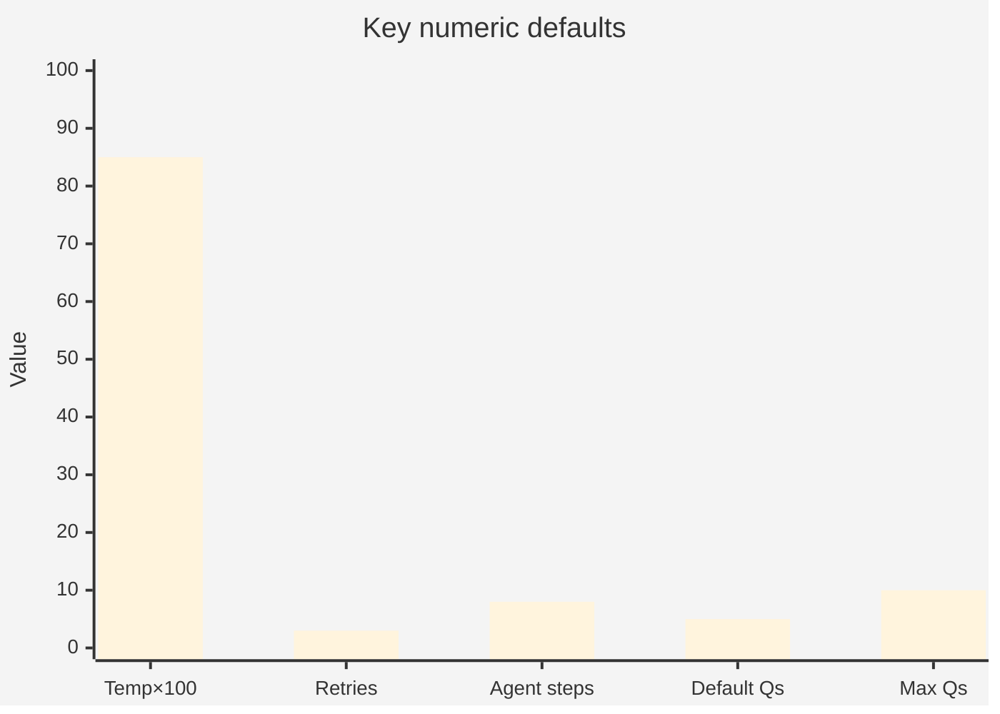
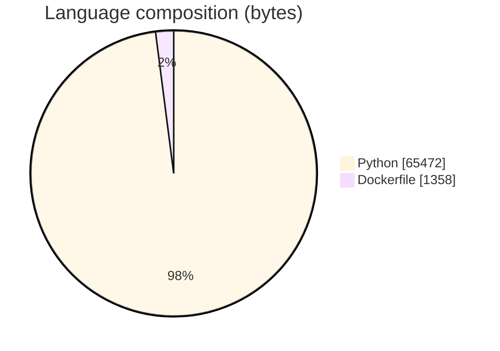
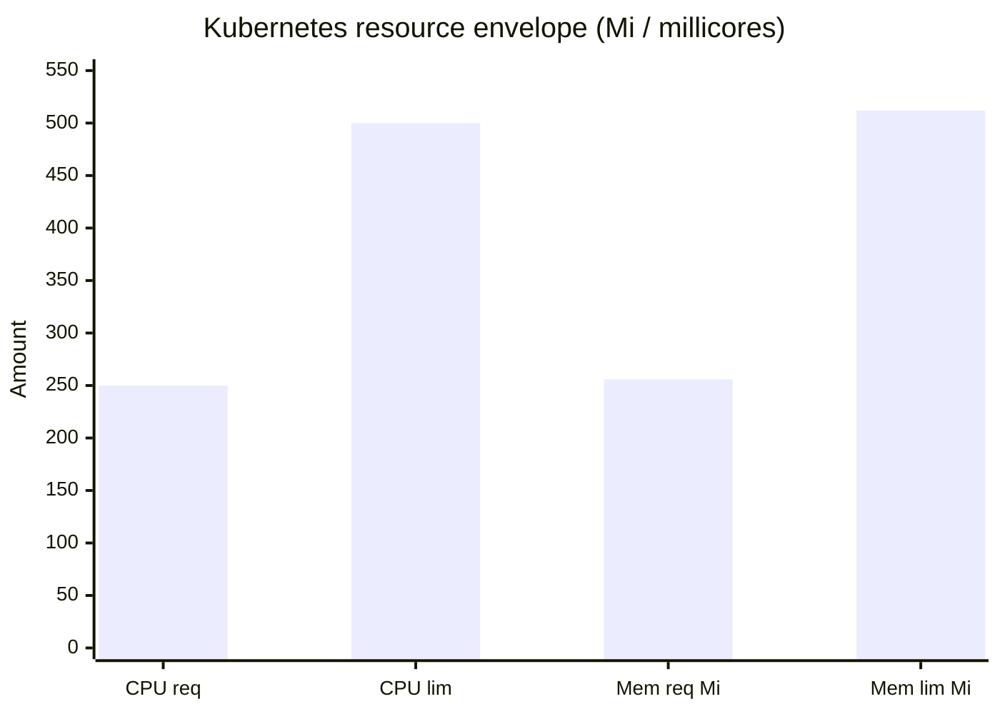
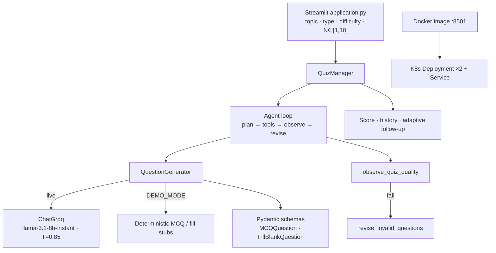
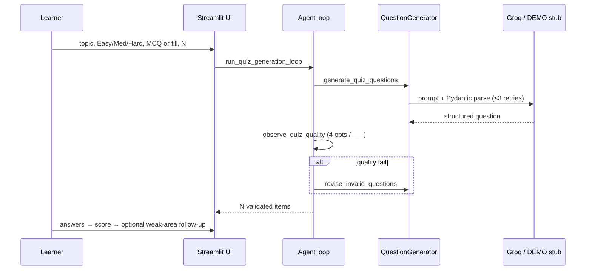
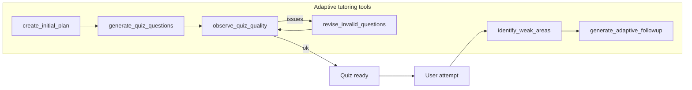
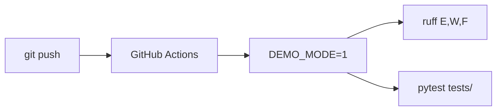

# Study Buddy AI

### Adaptive **Streamlit** quiz agent — **Groq LLaMA** + **LangChain** + plan→generate→observe→revise loop, with **DEMO_MODE**, Docker, and Kubernetes

<p align="center">
  
  
  
  
</p>

<p align="center">
  
  
  
  <a href="tests/"></a>
  
</p>

---

## Overview

**Study Buddy AI** generates on-demand quizzes for arbitrary topics:

| Mode | Question types | Difficulty |
|------|----------------|------------|
| Interactive Streamlit UI | **Multiple Choice** · **Fill in the Blank** | **Easy / Medium / Hard** |
| Batch size | Slider **1–10** (default **5**) | History of last **5** sessions |

Under the hood an **adaptive agent loop** plans generation, validates schema/quality, revises bad batches, and can build a **weak-area follow-up** quiz after scoring.

Signals for **Applied AI / Full-stack LLM / EdTech** portfolios: structured LLM outputs (Pydantic), agent tooling, offline DEMO stubs for CI, multi-stage Docker, and K8s manifests with secrets/probes.

> Config and test numbers below are from committed source. **No fabricated quiz-accuracy / BLEU scores** — none are published as formal eval harness results in-repo.

---

## Results & repository facts (traceable)

### Runtime defaults (`src/config/settings.py`)

| Setting | Default | Notes |
|---------|---------|--------|
| `MODEL_NAME` | **`llama-3.1-8b-instant`** | Override via env; docs suggest `llama-3.3-70b-versatile` for quality |
| `TEMPERATURE` | **0.85** | Aimed at question diversity (0.7–1.0 band) |
| `MAX_RETRIES` | **3** | Per-question LLM parse/retry |
| `MAX_AGENT_STEPS` | **8** | Cap on plan→tool loop |
| `DEFAULT_NUM_QUESTIONS` | **5** | UI slider default; max **10** |
| `DEFAULT_DIFFICULTY` | **medium** | |
| `DEFAULT_QUESTION_TYPE` | **Multiple Choice** | |
| `DEMO_MODE` | **auto** if `DEMO_MODE=1` **or** missing `GROQ_API_KEY` | Offline stubs |



### Schema / quality gates (code-enforced)

| Rule | Value |
|------|--------|
| MCQ options | **Exactly 4** (`MCQQuestion` + `observe_quiz_quality`) |
| Fill-blank marker | Must contain **`___`** |
| Generation retries | Up to **`MAX_RETRIES` (3)** before `CustomException` |
| Agent step budget | **`MAX_AGENT_STEPS` (8)** |

### Deploy / ops facts

| Fact | Value | Source |
|------|--------|--------|
| Container port | **8501** | Dockerfile / Streamlit |
| Health path | `/_stcore/health` | Dockerfile HEALTHCHECK · K8s probes |
| K8s replicas | **2** | `manifests/deployment.yaml` |
| Rolling update | `maxSurge: 1`, `maxUnavailable: 0` | deployment |
| Resource requests | **250m CPU · 256Mi** | deployment |
| Resource limits | **500m CPU · 512Mi** | deployment |
| Readiness | initial **10s**, period **10s**, fail **3** | deployment |
| Liveness | initial **20s**, period **20s**, fail **5** | deployment |
| Service | NodePort **80 → 8501** | `manifests/service.yaml` |
| Image name (manifest) | `dataguru97/studybuddy:latest` | deployment |
| CI Python | **3.11** · `DEMO_MODE=1` | GitHub Actions |
| Tracked files | **40** | git tree |
| Languages | Python **65,472** B · Dockerfile **1,358** B | GitHub API |
| pytest | **21** cases (`test_agent_loop` 11 + `TestStudyBuddy`/`TestStudySession` 10) | `tests/` |
| License | **MIT** | LICENSE |





---

## Architecture







---

## Agent & product features

- **Topic-driven generation** with LangChain prompt templates  
- **MCQ** (4 options, answer ∈ options) and **fill-in-the-blank** (`___`)  
- **Difficulty** Easy → Hard; agent may ease follow-ups for weak areas  
- **Quality observe/revise** inside `MAX_AGENT_STEPS`  
- **Score bar**, session **history** (last 5 captions), progress %  
- **DEMO_MODE** for CI/offline without spending Groq quota  
- **Tracing** helpers (`src/tracing.py`) around tool spans  
- **Docker multi-stage** + **Jenkinsfile** + **K8s** manifests  

---

## Repository layout

```text
Study-Buddy-AI/
├── application.py                 # Streamlit entry
├── src/
│   ├── config/settings.py         # model · temp · retries · agent steps
│   ├── generator/question_generator.py
│   ├── llm/groq_client.py
│   ├── models/question_schemas.py # Pydantic MCQ / FillBlank
│   ├── prompts/templates.py
│   ├── agent/{loop,planner,tools,types}.py
│   ├── utils/helpers.py           # QuizManager
│   └── tracing.py
├── tests/                         # DEMO_MODE forced in conftest
├── manifests/{deployment,service}.yaml
├── Dockerfile · Jenkinsfile · setup.py
├── CONTRIBUTING.md · LICENSE (MIT)
└── .github/workflows/ci.yml
```

---

## Tech stack & keywords

| Layer | Technology |
|-------|------------|
| UI | **Streamlit** ≥1.35 |
| LLM | **LangChain** + **langchain-groq** · **llama-3.1-8b-instant** |
| Validation | **Pydantic v2** schemas + quality observer |
| Agent | Plan / tools / revise / adaptive follow-up |
| Data | **pandas** (helpers) |
| Containers | **Docker** (Python 3.11-slim, multi-stage) |
| Orchestration | **Kubernetes** Deployment + Service |
| CI/CD | **GitHub Actions**, **Jenkins**, **ruff**, **pytest** |

**Keyword surface:** Python · Streamlit · LangChain · Groq · LLaMA · LLM · Pydantic · agentic AI · adaptive learning · quiz generation · DEMO_MODE · Docker · Kubernetes · CI/CD · pytest · education tech · prompt engineering

---

## Quickstart

```bash
git clone https://github.com/ArchanaChetan07/Study-Buddy-AI.git
cd Study-Buddy-AI

python -m venv .venv
# Windows: .\.venv\Scripts\Activate.ps1
source .venv/bin/activate

pip install -r requirements.txt
pip install -e .

# Live Groq
echo GROQ_API_KEY=your_key > .env
streamlit run application.py

# Offline / CI-style
DEMO_MODE=1 streamlit run application.py
pytest tests/ -v
```

**Docker**

```bash
docker build -t study-buddy-ai .
docker run -p 8501:8501 -e GROQ_API_KEY=... study-buddy-ai
# or -e DEMO_MODE=1
```

**Kubernetes** (after image push / secret `groq-api-secret`)

```bash
kubectl apply -f manifests/deployment.yaml
kubectl apply -f manifests/service.yaml
```

---

## Testing & CI

| Suite | Coverage |
|-------|----------|
| `test_agent_loop.py` (11) | DEMO stubs · generation loop · quality reject · revise · adaptive follow-up · fill-blank |
| `test_study_buddy.py` (10) | topic · structure · scoring · history · difficulty · progress · subjects |
| Actions | Python **3.11** · `DEMO_MODE=1` · ruff · `pytest tests/ -v` |



---

## Roadmap

- Quantitative quiz-quality / pedagogical eval harness (not present yet — do not claim accuracy %)  
- Optional RAG over learner notes  
- Helm chart wrapping current manifests  

---

<p align="center">
  <b>Study Buddy AI</b> · MIT License<br/>
  <a href="https://github.com/ArchanaChetan07/Study-Buddy-AI">github.com/ArchanaChetan07/Study-Buddy-AI</a>
</p>
