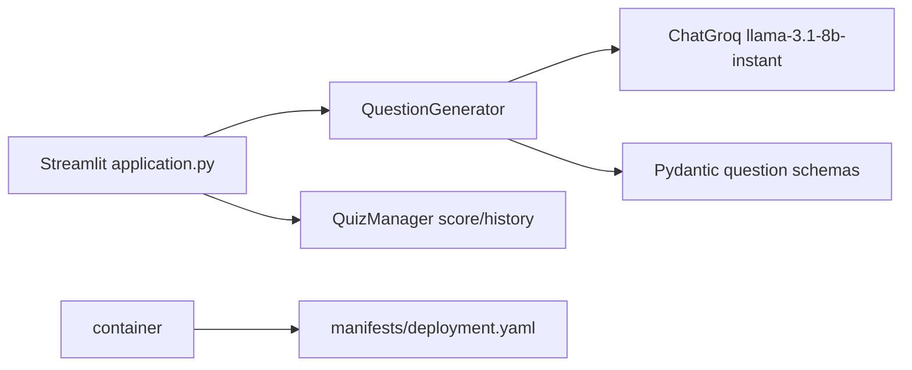
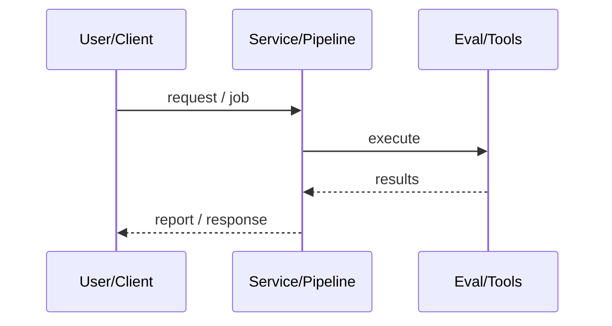
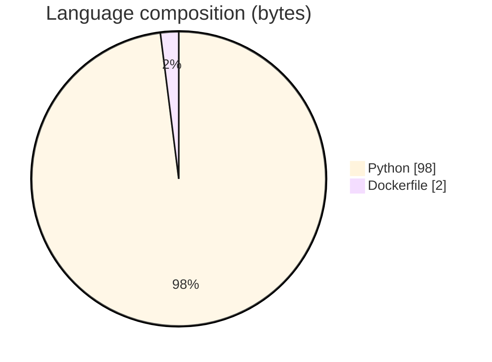

# Study Buddy AI Quiz Agent

### Streamlit adaptive quiz generator powered by Groq LLaMA via LangChain.

[](https://github.com/ArchanaChetan07/Study-Buddy-AI)
[](https://github.com/ArchanaChetan07/Study-Buddy-AI)
[](https://github.com/ArchanaChetan07/Study-Buddy-AI)
[](https://github.com/ArchanaChetan07/Study-Buddy-AI/actions)

---

## Overview

Learners need on-demand quizzes (MCQ / fill-in) at chosen difficulty for arbitrary topics.

Streamlit application.py with QuizManager + QuestionGenerator; LangChain ChatGroq (default llama-3.1-8b-instant); agent loop/planner/tools; Pydantic question schemas; Kubernetes manifests + Dockerfile + Jenkinsfile; DEMO_MODE without key.

Polished quiz UX with history/scoring, MIT license, CI/tests, and deploy manifests.

This repository is maintained as **production-minded portfolio work**: clear architecture, automated checks where present, and metrics that are **traceable to committed artifacts** (never invented).

---

## Architecture

Sidebar settings → QuestionGenerator (Groq/LangChain, validated schemas) → QuizManager presents items → submit → score/history; optional K8s deploy of containerized app.





---

## Results & repository facts

> Only values found in code, configs, tests, or generated reports are listed. Absence of a clinical/ML accuracy number means it was **not** published in-repo.

| Metric | Value | Source |
|---|---|---|
| Tracked repository files | **40** | `git tree` |
| Python modules | **27** | `git tree *.py` |
| Default MODEL_NAME | **llama-3.1-8b-instant** | `src/config/settings.py` |
| Default TEMPERATURE | **0.85** | `src/config/settings.py` |
| Default MAX_AGENT_STEPS | **8** | `src/config/settings.py` |
| Default MAX_RETRIES | **3** | `src/config/settings.py` |
| DEFAULT_NUM_QUESTIONS | **5** | `src/config/settings.py` |
| Tracked files | **40** | `git tree` |
| Python modules | **27** | `git tree` |
| Test-related paths | **3** | `git tree` |
| CI workflows | **Yes** | `.github/workflows` |
| Docker present | **Yes** | `repo root` |



---

## Key features

- Topic + difficulty + question-type controls
- Multiple choice and fill-in-the-blank generation
- Score bar and result history
- Agent retry loop with MAX_AGENT_STEPS
- K8s deployment/service manifests
- Contributing guide + MIT license

---

## Tech stack

| Layer | Technology |
|---|---|
| ui | Streamlit |
| llm | LangChain |
| llm | ChatGroq |
| model | llama-3.1-8b-instant |
| validation | Pydantic |
| containers | Docker |
| orchestration | Kubernetes |
| ci | GitHub Actions |
| ci | Jenkins |

---

## Skills demonstrated

Python · S · t · r · e · a · m · CI/CD · testing · automation

Keyword surface: **Python · Python · machine-learning · CI/CD · testing · API · Docker · automation · data-science · software-engineering · system-design · observability · LLM · cloud**

---

## Project structure

```text
Study-Buddy-AI/
├── application.py
├── src/{generator,llm,models,prompts,agent,config,common,utils,tracing}/
├── manifests/{deployment,service}.yaml
├── Dockerfile / Jenkinsfile / setup.py
├── tests/
├── LICENSE (MIT)
└── CONTRIBUTING.md
```

---

## Installation & usage

```bash
git clone https://github.com/ArchanaChetan07/Study-Buddy-AI.git
cd Study-Buddy-AI
pip install -r requirements.txt
echo GROQ_API_KEY=... > .env
streamlit run application.py
```

---

## How it works

Users set topic/type/difficulty; QuestionGenerator prompts Groq to emit structured questions; the UI collects answers and scores them. Without GROQ_API_KEY, DEMO_MODE serves stubs. K8s manifests target the containerized app.

---

## Future improvements

- Replace root README spam with CONTRIBUTING-aligned docs
- Add quantitative quiz-quality eval

---

## License

MIT.

---

<p align="center">
  <b>Study Buddy AI Quiz Agent</b><br/>
  <a href="https://github.com/ArchanaChetan07/Study-Buddy-AI">github.com/ArchanaChetan07/Study-Buddy-AI</a>
</p>
